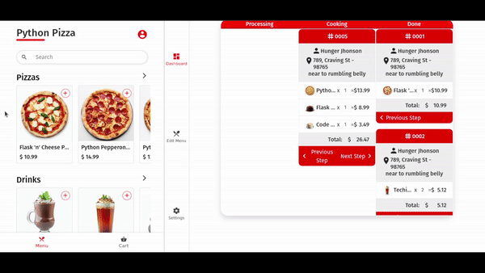

# AppetEats
#### Video Demo: https://www.youtube.com/watch?v=ulIYjXS80oE
#### Description: ApppetiEats is an Online Delivery Web Application that simplifies the gastronomic experience by allowing restaurants to display their menus and allowing their customers to place orders in an easy and intuitive way.


### This is my CS50 final project

## Table of Contents

- [Installation](#installation)
- [Usage](#usage)
- [Features](#features)
- [Structure](#structure)
- [License](#license)

## Installation

To set up AppetiEats, follow these steps:

```bash
# Clone the repository
git clone https://github.com/valentejorge/appetieats/

# Navigate to the project directory
cd AppetiEats

# Install required dependencies
pip install -r requirements.txt

# Load sample data
flask restart-db
```

## Usage

1. Start the application: 

```bash
flask run
```

or

```bash
flask run --host=0.0.0.0
```

2. Access the aplication through your web browser at `http://localhost:5000`

3. Restaurants can sign up, log in, add their menu items, generate a restaurant QR Code, and see orders in real-time in restaurant dashboard.

4. Customers can access restaurants menu through the QR code or a link, view menu, place orders, and track status of orders in real-time.

## Features

- **Restaurant Registration**: Restaurants can sign up and create accounts to showcase their menus.
- **Secure Passwords Storage**: Passwords are storage using hash and salt approach, following the good pratices of security information.
- **Menu Management**: Restaurants can add, edit, or remove items from their menus through an intuitive dashboard.
- **Dishes Images**: Restaurants can put images for they dishes, and rescale before upload images.
- **Customer Orders**: Customers can access a restaurant menus, place orders, and track their order status in real-time.
- **User Authentication**: Secure user authentication for both restaurants and customers.
- **Order History**: Customers and restaurants can view their order history.
- **Qr Code Generator**: Restaurants can generate a qr code that directs costumers to the restaurant's landing page.
- **Responsive Design**: The application was developed so that the user has the best use, both on mobile devices and desktops
- **Real Time Notifications**: Customer order notifications arrive in real time on the restaurant's dashboard, and a convenient bell sounds, notifying the new order, preventing the restaurant from having to reload the page to check new orders.

## Project Structure

```bash
.
├── appetieats (MAIN PACKAGE)
│   ├── app.py (APP FACTORIES)
│   ├── models.py (DATABASE MODELS)
│   ├── requirements.py (APP REQUIREMENTS)
│   ├── __init__.py
│   ├── ext (EXTENSIONS FACTORIES)
│   │   ├── __init__.py
│   │   ├── commands.py
│   │   ├── configuration.py
│   │   ├── database.py
│   │   ├── error.py
│   │   ├── events.py
│   │   ├── sesssion.py
│   │   └── helpers (HELPERS FUNCTIONS)
│   │       ├── __init__.py
│   │       ├── cache_images.py
│   │       ├── db_tools.py
│   │       ├── get_inputs.py
│   │       ├── register_tools.py
│   │       ├── sample_data.json
│   │       └── validate_inputs.py
│   │       
│   ├── routes (APP ROUTES)
│   │   ├── __init__.py
│   │   ├── auth.py
│   │   ├── customer.py
│   │   ├── main.py
│   │   ├── menu.py
│   │   ├── admin
│   │   │   ├── admin.py
│   │   │   └── settings.py
│   ├── static (STATIC FILES)
│   │   ├── assets
│   │   │   └── ...
│   │   ├── cache 
│   │   ├── css (CSS FILES)
│   │   │   └── ...
│   │   ├── js (JAVASCRIPT FILES)
│   │   │   ├── ...
│   │   │   ├── admin
│   │   │   │   ├── ...
│   │   │   │   └── socketio.js (WEBHOOKS SETTINGS)
│   │   │   ├── customer
│   │   │   │   ├── ...
│   │   │   │   └── socketio.js (WEBHOOKS SETTINGS)
│   │   │   ├── menu
│   │   │   │   ├── cart.js (CART SETTINGS)
│   │   │   │   └── ...
│   │   │   └── ...
│   │   └── sample_data (SAMPLE DATA FOR POPULATE DB)
│   │       ├── bacon.png
│   │       ├── ...
│   │       └── ...
│   ├── tests (TESTS FOLDER)
│   │   ├── conftest.py (CONFIG TESTS)
│   │   └── ...
│   └── templates (APP TEMPLATES)
│       ├── admin
│       │   ├── dashboard.html (RESTAURANT DASHBOARD)
│       │   ├── settings
│       │   │   ├── ...
│       │   │   └── qr-code.html (QR CODE GENERATOR)
│       │   └── settings.html
│       ├── auth
│       │   └── ...
│       ├── customer
│       │   └── ...
│       ├── ...
│       └── menu
│           └── ...
├── instance (FLASK INSTANCE)
│   ├── test.db
│   └── database.db
├── LICENSE
├── settings.toml (APP SETTINGS)
└── README.md
```

I followed Flask's factory architecture [(see more in documentation)](https://flask.palletsprojects.com/en/3.0.x/patterns/appfactories/) so I modularized my project, because after working on it a little and seeing that there were already too many lines and I couldn't find it, it became very difficult to make any progress, as I would first need to understand where things were and then implement a new functionality.

So I searched a lot for how to format in the best way, always trying to apply good practices (most of the time), I learned a lot about architecture and design patterns, [(this video helped me a lot with that, thank you Bruno Rocha)](https://www.youtube.com/watch?v=-qWySnuoaTM), and after modularizing you can notice that inside the module there are 5 directories: extensions, routes, statics, tests, models and in the root you can find the canonical flask files such as app.py, requirements.py...

### Extensions (/ext)
In the ext dir we can find the:

- `comands.py` as responsible for flask commands, such create, restart and drop database, and populate database from a json file.

- `configuration.py` as responsible for configure the application using the [FlaskDynaConf](https://www.dynaconf.com/flask/)

- `error.py` as responsible for configure the error page with a [Custom Error Page](https://flask.palletsprojects.com/en/3.0.x/errorhandling/)

- `socketio.py` as responsible for configure the webhooks and rooms using [Flask SocketIO](https://flask-socketio.readthedocs.io/en/latest/getting_started.html#rooms)

- `sesssions.py` as responsible for configure the sessions

- `/helpers` initialy was a unique file call `helper.py` but, because the i needed more help, it became a dir with multiple files inside divided by domain, so inside of `/helpers` we can find:

    - `cache_images.py` as responsible for verify if image exists in cache, and create the cache of image if not exists.

    - `db_tools.py` as responsible for provide tools for manipulate database and make more easy and reusable many commands of database.

    - `format_data.py` as responsible for format the data from database, is very usefull and makes it easier to know if the restaurant is open.

    - `get_inputs.py` as responsible for provide tools for get inputs from user and make more easy and reusable many functions for get data
.
    - `register_tools.py` as responsible for provide tools for register and login the users.

    - `sample_data.json` as responsible for provide a json data for populate a database with flask commands such `flask restart-db`.

    - `test_sample_data.json` as responsible for provide a json file only for tests enviroment.

    - `validate_inputs.py` as responsible for provide tools for check user inputs and if it is incorrect returns specific error message.


### Routes (/routes)

In the routes dir we can find files of flask routes divides for domains and responsability, such:

- `auth.py` for routes of authentication, such `/login/customer` or `/register/restaurant`...

- `customer.py` for routes of customer pages, such `/customer/change-password`.

- `main.py` for commom routes of application, such landing page and a error.

- `menu.py` for routes of landing page and menu page of restaurants.

- `/admin` as a subdirectory with `admin.py` and `settings.py` for routes to admin stuff and restaurant settings respectively.

### Static Files (/static)

In the static directory we can find static files such as css, javascript, images, sounds and I want to highlight some such as:

- `/static/js/menu/shopping.js` as a file responsible for everything related to the restaurant menu purchase page, to dynamically obtain data from an api that returns restaurant data, build the page with this data, dividing the products into their respective categories, updating the cart items and searching for products in the menu.

- `/static/js/menu/landing.js` as file responsible for get the data from an api located at `/[restaurant_name]/landing/data` and display if the restaurant is open, all restaurant's opening hours, and redirect to restaurant menu page.

### Templates (/templates)

In the template directory we can find all the templates that will be displayed when accessing most routes, I worked hard and dedicated myself as much as I could to make the templates look pleasant and have a great UX, and responsive to the most varied screen sizes. And here are some examples:


the register page


the restaurant page, the orders page, and the dashboard page and their responsiveness

---
## License 

This project is licensed under the MIT License - see the [LICENSE](LICENSE) file for details.

```
MIT License
```
